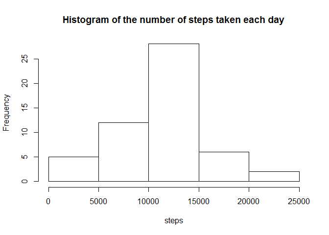
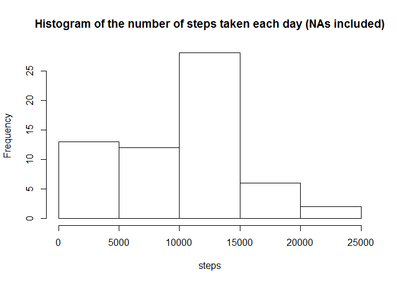
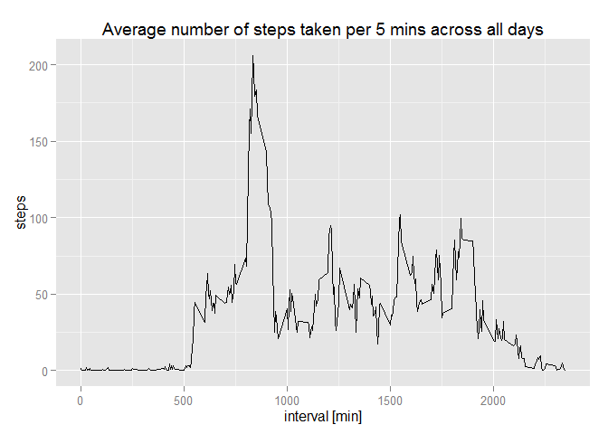
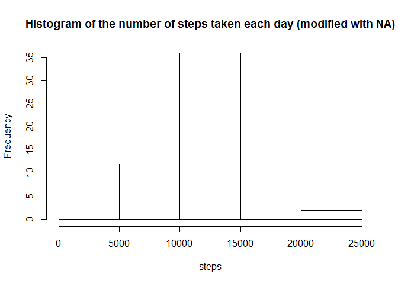
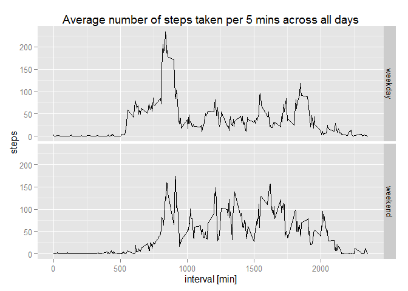

# Reproducible Research: Peer Assessment 1


## Loading and preprocessing the data

####1. Load the data.

The data file activity.csv is extracted from the .zip file and is stored at R working directory.


```r
data <- read.csv("activity.csv")
head(data)
```

```
##   steps       date interval
## 1    NA 2012-10-01        0
## 2    NA 2012-10-01        5
## 3    NA 2012-10-01       10
## 4    NA 2012-10-01       15
## 5    NA 2012-10-01       20
## 6    NA 2012-10-01       25
```

## What is mean total number of steps taken per day?

####1. Calculate the total number of steps taken per day

In the data set, there are some days in which the steps value are NA. These days will be dismissed in the data analysis in this question. We can use function `aggregate` to calculate the  number of steps accumulated in each days. Days where the steps are NA are ignored by such function by default `(na.action = na.omit)`. 

The call of `aggregate` function will create a separated summarized dataframe which contains one column for `date` and another column for the total `steps`.


```r
total_steps <- aggregate(steps ~ date, data = data, sum)
head(total_steps)
```

```
##         date steps
## 1 2012-10-02   126
## 2 2012-10-03 11352
## 3 2012-10-04 12116
## 4 2012-10-05 13294
## 5 2012-10-06 15420
## 6 2012-10-07 11015
```

If by any chance we want to include the dates whose steps are NAs into the summarized dataset, it can be done by using `na.action = na.pass` for `aggregate` (to keep the NAs) and `na.rm = TRUE` for `sum`


```r
total_steps_2 <- aggregate(steps ~ date, data = data, sum, na.action = na.pass, na.rm = TRUE)
head(total_steps_2)
```

```
##         date steps
## 1 2012-10-01     0
## 2 2012-10-02   126
## 3 2012-10-03 11352
## 4 2012-10-04 12116
## 5 2012-10-05 13294
## 6 2012-10-06 15420
```

####2. Make a histogram of the total number of steps taken each day.

A simple and quick histogram for the new dataset `total_steps` can be done by using plotting function `hist`.


```r
hist(total_steps$steps, 
     main = "Histogram of the number of steps taken each day", 
     xlab = "steps")
```

 

A simple histogram for this dataset if dates with NAs values are regarded as zero and are included in the dataset:


```r
hist(total_steps_2$steps, 
     main = "Histogram of the number of steps taken each day (NAs included)", 
     xlab = "steps")
```

 

####3. Calculate and report the mean and median of the total number of steps taken per day

Using `total_steps` as the dataset for inspection, the `mean` and `median` can be caluclated using the function with the same name.


```r
mean_steps <- mean(total_steps$steps)
median_steps <- median(total_steps$steps)
```

Hence, the `mean_steps` is 1.0766189\times 10^{4} and the `median_steps` is 10765 (Here the numeric format is modified by global option `options(scipen=1, digits=2)`)

## What is the average daily activity pattern?

####1. Make a time series plot (i.e. type = "l") of the 5-minute interval (x-axis) and the average number of steps taken, averaged across all days (y-axis).

Similarly, we can use `aggregate` to calculate the total number of steps taken of each interval (5 mins) in the `interval` column of `data` dataset. Again, NAs are dismissed by default.


```r
steps_interval <- aggregate(steps ~ interval, data = data, mean)
head(steps_interval)
```

```
##   interval     steps
## 1        0 1.7169811
## 2        5 0.3396226
## 3       10 0.1320755
## 4       15 0.1509434
## 5       20 0.0754717
## 6       25 2.0943396
```

A simple line plot of interval vs steps can be made by using either the base plot system or ggplot2 system or lattice. This code below illustrate the use of ggplot system.


```r
library(ggplot2)
g <- ggplot(steps_interval, aes(interval, steps))
g + geom_line() + 
    labs(title = "Average number of steps taken per 5 mins across all days", x = "interval [min]", y = "steps")
```

 

####2. Which 5-minute interval, on average across all the days in the dataset, contains the maximum number of steps?

The maximum number of steps together with its corresponding interval can be found using `subset`


```r
max <- subset(steps_interval, steps == max(steps))
max #Show the maxium steps at the found interval
```

```
##     interval    steps
## 104      835 206.1698
```

## Imputing missing values

####1.  Calculate and report the total number of missing values in the dataset (i.e. the total number of rows with NAs)

Since only column `steps` in the original `data` dataset has `NA`s values, we can count the total number of `NA`s values using `is.na` and `sum` functions:


```r
total_NAs <- sum(is.na(data$steps))
total_NAs #Show the result
```

```
## [1] 2304
```

####2.  Devise a strategy for filling in all of the missing values in the dataset. The strategy does not need to be sophisticated.

The missing values in the dataset will be replaced with the mean values of the number of steps (the data of which was obtained above) at their intervals.

First, we need to locate the index number of the missing value in the `data` dataset. This can be done using `which` and `is.na` function:


```r
ind <- which(is.na(data$steps), arr.ind = TRUE)
summary(ind)
```

```
##    Min. 1st Qu.  Median    Mean 3rd Qu.    Max. 
##       1    7273   10660    9324   12020   17570
```

A new dataset, `modified_data`, is created based on the original dataset `data`. In this replidated dataset, we will replace the missing value with the mean value (steps) obtained from `steps_interval`.

This can be done using a nested `for` loop function which will operate as follow:
+ The outer `for` loop will run through the length of the `ind` vector obtained above. 
+ For each of index value, the corresponding interval number will be compared with the interval values in the `steps_interval` dataset by using another `for` loop nested inside. Once matched, the steps value of `steps_interval` will be assigned to that missing value.


```r
modified_data <- data
for (i in 1:length(ind)) { #Looping through the extracted NA index
    l <- ind[i]            #Assigning the current index value to j
    for (j in 1:length(steps_interval$interval)) { #Lopping through the steps_interval      
        if (modified_data$interval[l] == steps_interval$interval[j]) { #If condition to compare the interval value of two datasets         
            modified_data$steps[l] <-steps_interval$steps[j] #Assigning the mean value to the missing value with the two interval values are the same
        }
    }
}
```
####3.Create a new dataset that is equal to the original dataset but with the missing data filled in.

The new dataset with the filled in missing values is here:


```r
head(modified_data)
```

```
##       steps       date interval
## 1 1.7169811 2012-10-01        0
## 2 0.3396226 2012-10-01        5
## 3 0.1320755 2012-10-01       10
## 4 0.1509434 2012-10-01       15
## 5 0.0754717 2012-10-01       20
## 6 2.0943396 2012-10-01       25
```

####4. Make a histogram of the total number of steps taken each day and Calculate and report the mean and median total number of steps taken per day. Do these values differ from the estimates from the first part of the assignment? What is the impact of imputing missing data on the estimates of the total daily number of steps?

Similarly, the new total number of steps taken per day can be calculated using the aggregate function.


```r
new_total_steps <- aggregate(steps ~ date, data = modified_data, sum)
head(new_total_steps)
```

```
##         date    steps
## 1 2012-10-01 10766.19
## 2 2012-10-02   126.00
## 3 2012-10-03 11352.00
## 4 2012-10-04 12116.00
## 5 2012-10-05 13294.00
## 6 2012-10-06 15420.00
```

Create the histogram:

```r
hist(new_total_steps$steps,
     main = "Histogram of the number of steps taken each day (modified with NA)", 
     xlab = "steps")
```

 

Comparing the three histograms; one which excluding NA, one which including NA and setting them to zero and one which modified NAs value; we can see that they are visually not very different.

Finding mean and median value of `new_total_steps`:


```r
mean_new_total_steps <- mean(new_total_steps$steps)
mean_new_total_steps
```

```
## [1] 10766.19
```

```r
median_new_total_steps <- median(new_total_steps$steps)
median_new_total_steps
```

```
## [1] 10766.19
```

## Are there differences in activity patterns between weekdays and weekends?

####1. Create a new factor variable in the dataset with two levels - "weekday" and "weekend" indicating whether a given date is a weekday or weekend day.

Convert the date variable in `data` to `date, POSIXlt` class.


```r
data$date <- strptime(as.character(data$date), "%Y-%m-%d")
```

Using `weekdays()` function to find the day from date


```r
day <- weekdays(data$date)
table(day)
```

```
## day
##    Friday    Monday  Saturday    Sunday  Thursday   Tuesday Wednesday 
##      2592      2592      2304      2304      2592      2592      2592
```

Using `for` loop to determine whether a day is weekday or weekend, and stored the result in `day_type`:


```r
day_type <- character()
for (i in 1:length(day)) {
    if (day[i] == "Sunday" | day[i] == "Saturday") 
        day_type[i] <- "weekend"
    else day_type[i] <- "weekday"
}
table(day_type)
```

```
## day_type
## weekday weekend 
##   12960    4608
```

Combine the `day` and `day_type` to the `data` using `cbind`:


```r
data <- cbind(data, day, day_type)
head(data)
```

```
##   steps       date interval    day day_type
## 1    NA 2012-10-01        0 Monday  weekday
## 2    NA 2012-10-01        5 Monday  weekday
## 3    NA 2012-10-01       10 Monday  weekday
## 4    NA 2012-10-01       15 Monday  weekday
## 5    NA 2012-10-01       20 Monday  weekday
## 6    NA 2012-10-01       25 Monday  weekday
```

```r
str(data)
```

```
## 'data.frame':	17568 obs. of  5 variables:
##  $ steps   : int  NA NA NA NA NA NA NA NA NA NA ...
##  $ date    : POSIXlt, format: "2012-10-01" "2012-10-01" ...
##  $ interval: int  0 5 10 15 20 25 30 35 40 45 ...
##  $ day     : Factor w/ 7 levels "Friday","Monday",..: 2 2 2 2 2 2 2 2 2 2 ...
##  $ day_type: Factor w/ 2 levels "weekday","weekend": 1 1 1 1 1 1 1 1 1 1 ...
```

####2. Make a panel plot containing a time series plot (i.e. type = "l") of the 5-minute interval (x-axis) and the average number of steps taken, averaged across all weekday days or weekend days (y-axis).

Again, using `aggragte()` to sort and summarize the average number of steps taken based on both `interval` and `day_type`:


```r
new_steps_interval <- aggregate(steps ~ interval+day_type, data = data, mean)
head(new_steps_interval)
```

```
##   interval day_type     steps
## 1        0  weekday 2.3333333
## 2        5  weekday 0.4615385
## 3       10  weekday 0.1794872
## 4       15  weekday 0.2051282
## 5       20  weekday 0.1025641
## 6       25  weekday 1.5128205
```

We will use `ggplot2` to create the panel plot with condition specied above


```r
g <- ggplot(new_steps_interval, aes(interval, steps))
g + geom_line() + 
    labs(title = "Average number of steps taken per 5 mins across all days", x = "interval [min]", y = "steps") +
      facet_grid(day_type ~.)
```

 
